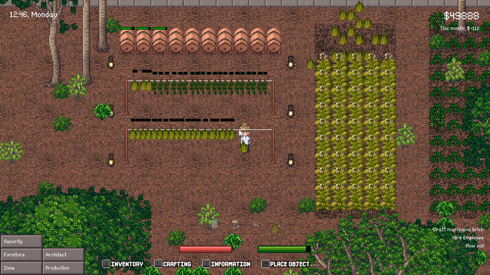

# Game Design Document - Venganza Cartel

## Introduction

### Pitch

Vengaza Cartel is a top-down game about establishing
your own cartel by constantly expanding your market
in an story-driven open world map.

### Inspiration

#### [My Drug Cartel](https://store.steampowered.com/app/2861950/My_Drug_Cartel/)

My Drug Cartel puts you in charge of a criminal empire, managing
plantations, staff, and weapons to grow, produce, and distribute
illicit drugs. Starting with a small grow-op, you’ll refine crops,
direct workers, and expand your operation—balancing profits with
the risks of rivals and law enforcement requiring
strategic planning to thrive.

#### [Schedule 1](https://store.steampowered.com/app/3164500/Schedule_I/)

In Schedule 1, players manage a drug empire in Hyland Point,
starting with a small grow operation. You cultivate plants,
produce drugs, and oversee distribution through hired dealers
and properties. Expansion increases profits but risks detection
by police and rivals requiring careful strategy to succeed.

### Player Experience

The player start off with almost nothing in an open word and has
to plan his strategy to expand his cartel. The player must learn the process
of producing and selling goods while considering the relation with customers.

### Genre

- Singleplayer
- open-world
- rpg
- strategy
- casual

### Target Audience

Due to time-consuming chains of production,
and complicated relation and manufacturing logic the game is aimed at players
that enjoy both a casual and strategic experience.

## Concept

### Gameplay overview

The player controls a cartel member. He may seed plant,
produce drugs and sell them to customers to earn money for
further operations and influence his relationships. The
player can navigate through the open world exploring new
location for his cartel.

Pending ideas:

- Employees
- Heat (Recognition from police)

### Primary Mechanics

| Action  | Description                                       | Visualisation |
|---------|---------------------------------------------------|---------------|
| Field   | The player can convert grass into a field         | tbd           |
| Sow     | The player can sow fields                         | tbd           |
| Water   | The player can water plants                       | tbd           |
| Harvest | The player can harvest plants                     | tbd           |
| Dry     | Some plants require drying that the player can do | tbd           |
| Sell    | The player can sell drugs to other people         | tbd           |

### Secondary Mechanics

<small>
Supporting systems that add depth to gameplay.
</small>

## Design

<small>
Details about art style and sound design.
</small>

## Development Milestones

<small>
The major phases and goals for the game's development.
</small>